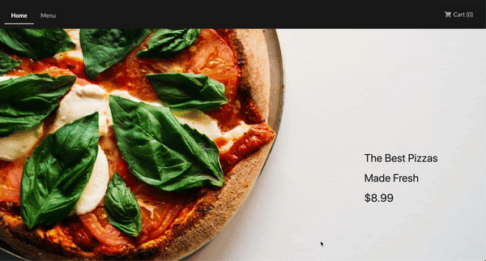

**Pizza Store**
---------
This project is a simple e-commerce app with shopping cart functionality. It uses Stripe Checkout to process payments.

**Tech Used**
---------
React | Redux | Node | Express

**Demo**
---------

**Installation**
---------
If you want to run this project locally, you can clone it down to your machine. Afterwards run cd into it and run `yarn` or `npm install` to install dependencies. To fire it up, in `pizza-store` run `yarn run dev`. Alternatively, you can interact with the live version at https://damp-coast-52194.herokuapp.com/. 

**License**
---------
This project is licensed under the MIT License
